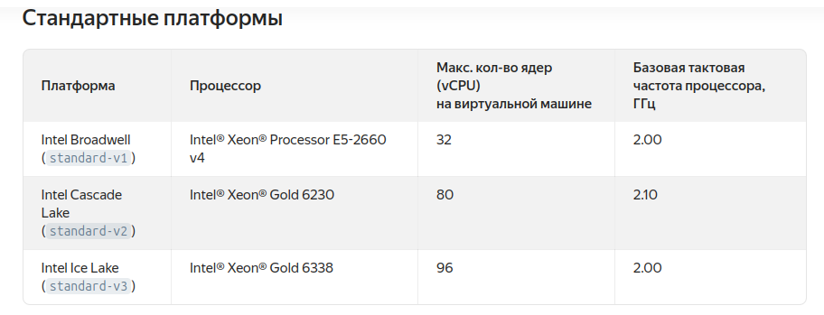
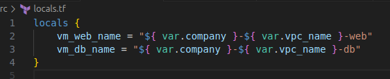
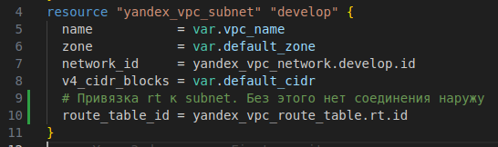

[Задание](https://github.com/netology-code/ter-homeworks/blob/main/02/hw-02.md)

## Задание 1
#### 2 Создать сервисный аккаунт и ключ. [service_account_key_file](https://terraform-provider.yandexcloud.net/).

Сохраняем полученный ключ в ~/.yc_authorized_key.json (добавил префикс `yc_` - чтобы по имени файла было понятно, что этот ключ относится к Yandex Cloud)
Также меняем service_account_key_file 

#### 3. Сгенерируйте новый или используйте свой текущий ssh-ключ. Запишите его открытую(public) часть в переменную vms_ssh_public_root_key.

Вставляем содержимое файла `~/.ssh/id_ed25519.pub` в значение `default` переменной `vms_ssh_root_key` файла [variables.tf](src/variables.tf)

#### 4. Инициализируйте проект, выполните код. Исправьте намеренно допущенные синтаксические ошибки. Ищите внимательно, посимвольно. Ответьте, в чём заключается их суть.

`terraform init`  
Код инициализировался.

`terraform apply`  
Получаем ошибку:

Исправляем ошибку (stantadt меняем на standard)

Опять ошибка - платформа не найдена:

Ищем в документации, какие могут быть [стандартные платформы](https://yandex.cloud/ru/docs/compute/concepts/vm-platforms):

Меняем на допустимую, например, `"standard-v3"`  
Уже лучше:  

Смотрим, что ещё может быть не так:

Меняем core fraction на 20, memory на 2, core на 2:  

Машина создалась  

#### 5 Подключитесь к консоли ВМ через ssh и выполните команду `curl ifconfig.me`. 

`ssh ubuntu@89.169.144.172`  

#### 6 Ответьте, как в процессе обучения могут пригодиться параметры preemptible = true и core_fraction=5 в параметрах ВМ

`preemptible = true` -  создаёт прерываемую ВМ
`core_fraction = 5` - гарантированная доля vCPU, которая будет выделена ВМ.  
Эти параметры помогают создать более дешёвую ВМ. Т.к. наша задача - научиться работать ВМ (менять, удалять), а не использовать их вычислительные ресурсы, то создаём машины с минимальным количеством ресурсов.

## Задание 2
#### 1. Замените все хардкод-значения для ресурсов yandex_compute_image и yandex_compute_instance на отдельные переменные. К названиям переменных ВМ добавьте в начало префикс vm_web_ . Пример: vm_web_name.
#### 2. Объявите нужные переменные в файле variables.tf, обязательно указывайте тип переменной. Заполните их default прежними значениями из main.tf.
#### 3. Проверьте terraform plan. Изменений быть не должно.

Создаём необходимые переменные:  

Пользователя (`ubuntu`) для `metadata.ssh-keys` переносим с другим префиксом, по аналогии `vms_ssh_root_key`:  

Подставляем переменные вместо значений в `main.tf`:  

Проверяем  
`terraform plan`  
`terraform apply`  
Сервер создался:

Удаляем `terraform destroy`

## Задание 3
#### 1. Создайте в корне проекта файл 'vms_platform.tf' . Перенесите в него все переменные первой ВМ.  
#### 2. Скопируйте блок ресурса и создайте с его помощью вторую ВМ в файле main.tf: "netology-develop-platform-db" , cores  = 2, memory = 2, core_fraction = 20. Объявите её переменные с префиксом vm_db_ в том же файле ('vms_platform.tf'). ВМ должна работать в зоне "ru-central1-b"
#### 3. Примените изменения.

Создаём [`vms_platform.tf`](src/vms_platform.tf), копируем туда переменные меняем имена, добавляем переменую зоны и cidr.  

Копируем блок создания vm и меняем имена переменных в [`main.tf`](src/main.tf), добавляем зону.

Также нужно добавить ещё одну подсеть в main.tf:

Запускаем. Машини создались.

## Задание 4
#### 1. Объявите в файле outputs.tf один output , содержащий: instance_name, external_ip, fqdn для каждой из ВМ в удобном лично для вас формате.(без хардкода!!!)

Добавляем переменную в [`outputs.tf`](src/outputs.tf)

#### 2. Примените изменения.
Запускаем, машины создались, output:

## Задание 5
#### 1. В файле locals.tf опишите в одном local-блоке имя каждой ВМ, используйте интерполяцию ${..} с НЕСКОЛЬКИМИ переменными по примеру из лекции.
#### 2. Замените переменные внутри ресурса ВМ на созданные вами local-переменные.
#### 3. Примените изменения.

Чтобы использовать интерполяцию, объявим ещё одну переменную, например "company":

Удаляем переменные vm_web_name и vm_db_name и переносим их в locals.

Меняем name для машин:
Вместо  
`name        = var.vm_web_name`  
пишем  
`name        = local.vm_web_name`  
Аналогично для `vm_web_db`

Запускаем:  

Проверяем в Yandex Console:

## Задание 6
#### 1. Вместо использования трёх переменных ".._cores",".._memory",".._core_fraction" в блоке resources {...}, объедините их в единую map-переменную vms_resources и внутри неё конфиги обеих ВМ в виде вложенного map(object).
Т.к. у меня было две переменнх типа `object` - `vms_web_resources` и `vms_db_resources`, удаляю их и создаю одну `map(object)`, добавляя в объект `hdd_size` и `hdd_type`  

#### 2. Создайте и используйте отдельную map(object) переменную для блока metadata, она должна быть общая для всех ваших ВМ.

Создаём новую переменную в locals, т.к. используем интерполяцию:  

Соответственно, в main.tf меняем блок metadata:  

#### 3. Найдите и закоментируйте все, более не используемые переменные проекта.
Старался сразу удалять все неиспользуемые переменные.

Для проверки ставим tflint и запускаем:

Он нашёл 3 переменные в файле `console.tf`, их оставляем.  
Также нашёл отсутствие версии провайдера:

Исправляем:  

#### 4. Проверьте terraform plan. Изменений быть не должно.

## Задание 7*
#### Изучите содержимое файла console.tf. Откройте terraform console, выполните следующие задания:

#### 1. Напишите, какой командой можно отобразить второй элемент списка test_list.
Т.к. элементы нумеруются с нуля, то второй в человеческом понимании это элемент с индексом 1:

#### 2. Найдите длину списка test_list с помощью функции length(<имя переменной>).

#### 3. Напишите, какой командой можно отобразить значение ключа admin из map test_map.
`local.test_map["admin"]`  
`local.test_map.admin`  

#### 4. Напишите interpolation-выражение, результатом которого будет: "John is admin for production server based on OS ubuntu-20-04 with X vcpu, Y ram and Z virtual disks", используйте данные из переменных test_list, test_map, servers и функцию length() для подстановки значений.
Можно так:
`"${local.test_map.admin} is admin for ${local.test_list[2]} server based on OS ${local.servers.production.image} with ${local.servers.production.cpu} vcpu, ${local.servers.production.ram} ram and ${length(local.servers.production.disks)} virtual disks"`

Лучше так:
`"${local.test_map[keys(local.test_map)[0]]} is ${keys(local.test_map)[0]} for ${local.test_list[2]} server based on OS ${local.servers.production.image} with ${local.servers.production.cpu} vcpu, ${local.servers.production.ram} ram and ${length(local.servers.production.disks)} virtual disks"`

## Задание 8*
Пишем переменную в [terraform.tfvars](src/terraform.tfvars)

Пишем описание переменной в [variables.tf](src/variables.tf)  

Проверяем в консоли:  

## Задание 9*
#### Используя инструкцию https://cloud.yandex.ru/ru/docs/vpc/operations/create-nat-gateway#tf_1, настройте для ваших ВМ nat_gateway. Для проверки уберите внешний IP адрес (nat=false) у ваших ВМ и проверьте доступ в интернет с ВМ, подключившись к ней через serial console. Для подключения предварительно через ssh измените пароль пользователя: `sudo passwd ubuntu`

Добавляем два ресурса в [main.tf](src/main.tf)  

У одной из машин меняем в `resources` `nat = false`

Запускаем - машины создались:  

Временно добавляем внешний ip чтобы задать пароль

Но, что-то не сработало. С первой машиной по внутренней сети связь есть, а с внешним миром связи нет:  

После первой неудачной попытки сделал изменения:

Но результата это не дало. Не пойму, в что не так.
